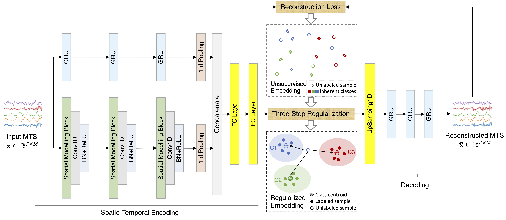
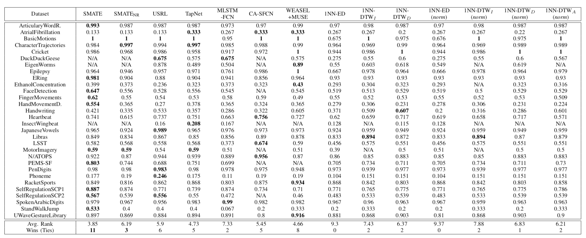
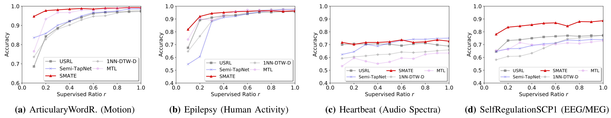
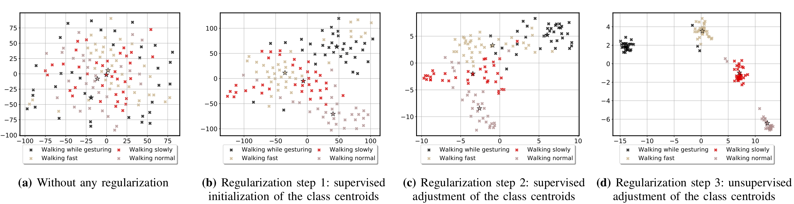
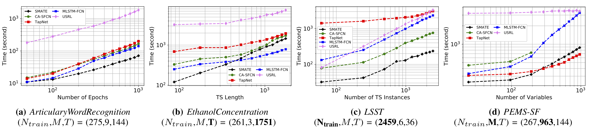

## SMATE: Semi-Supervised Spatio-Temporal Representation Learning on Multivariate Time Series
This is the implementation of SMATE in the following paper: [SMATE: Semi-Supervised Spatio-Temporal Representation Learning on Multivariate Time Series](https://arxiv.org/pdf/2110.00578.pdf).



<p align="center"><b>Figure 1</b>: The architecture of SMATE</p>


### Requirements

- graphviz=2.40.1
- keras=2.2.4
- Matplotlib=3.2.1
- numpy=1.16.4
- pandas=0.24.2
- pydot=1.4.1
- scikit-learn=0.21.2
- tensorflow=1.14.0 with CUDA 10.2

Dependencies can be installed using the following command:

```
pip install -r requirements.txt
```

### Data

Due to the space constraint, we include only part of UEA-MTS datasets in this repo. However, you can find the full datasets on www.timeseriesclassification.com. We provide [the preprocessing code](./Datasets/MTS-UEA/Preprocessing_MTS_UEA.ipynb) for the *Weka formatted ARFF files*.

### Usage

```python
python SMATE_classifier.py --ds_name DATASET_NAME
```

### Results

<b>Fully supervised results on UEA-MTS archive (30 datasets)</b>



<p align="center"><b>Figure 2</b>: Fully supervised results on UEA-MTS archive</p>

<br>

<b>Semi-supervised results on datasets from four different domains</b>



<p align="center"><b>Figure 3</b>: Semi-supervised results on datasets from four different domains</p>

<br>

<b>Interpretability of the semi-supervised regularisation process & classification results</b>



<p align="center"><b>Figure 4</b>: The t-SNE visualization of the representation space for the <i>Epilepsy</i> dataset, with 10% supervision.</p>

<br>

<b>Model efficiency </b>



<p align="center"><b>Figure 5</b>: Training time regarding to: (a) training epochs; (b) TS length; (c) Instance numbers; (d) Variable numbers </p>

<br>

### Citation

If you find this repository useful in your research, please consider citing the following paper:

```script
@article{zuo2021smate,
  title={SMATE: Semi-Supervised Spatio-Temporal Representation Learning on Multivariate Time Series},
  author={Zuo, Jingwei and Zeitouni, Karine and Taher, Yehia},
  journal={arXiv preprint arXiv:2110.00578},
  year={2021}
}
```


### Acknowlegements

The authors would like to thank Anthony Bagnall and his team for providing the community with valuable datasets and source codes in the UEA & UCR Time Series Classification Repository.

